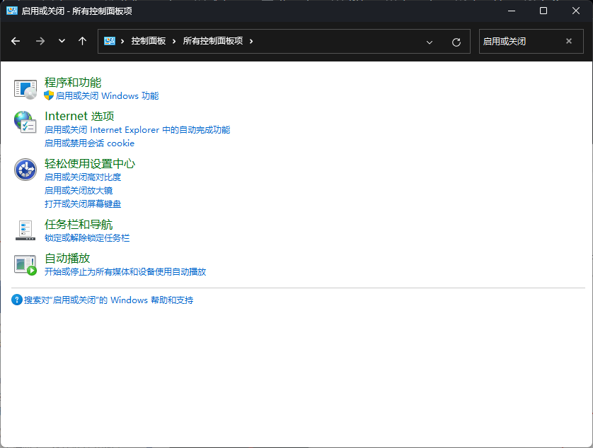
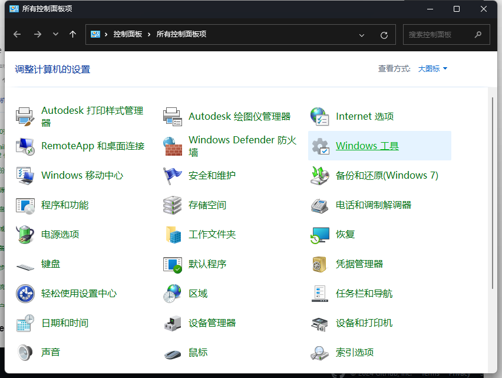
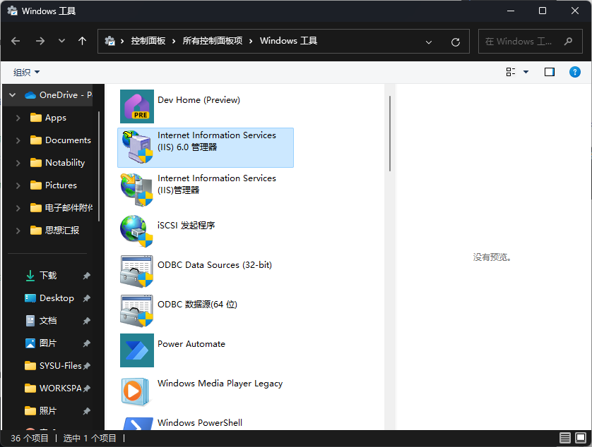
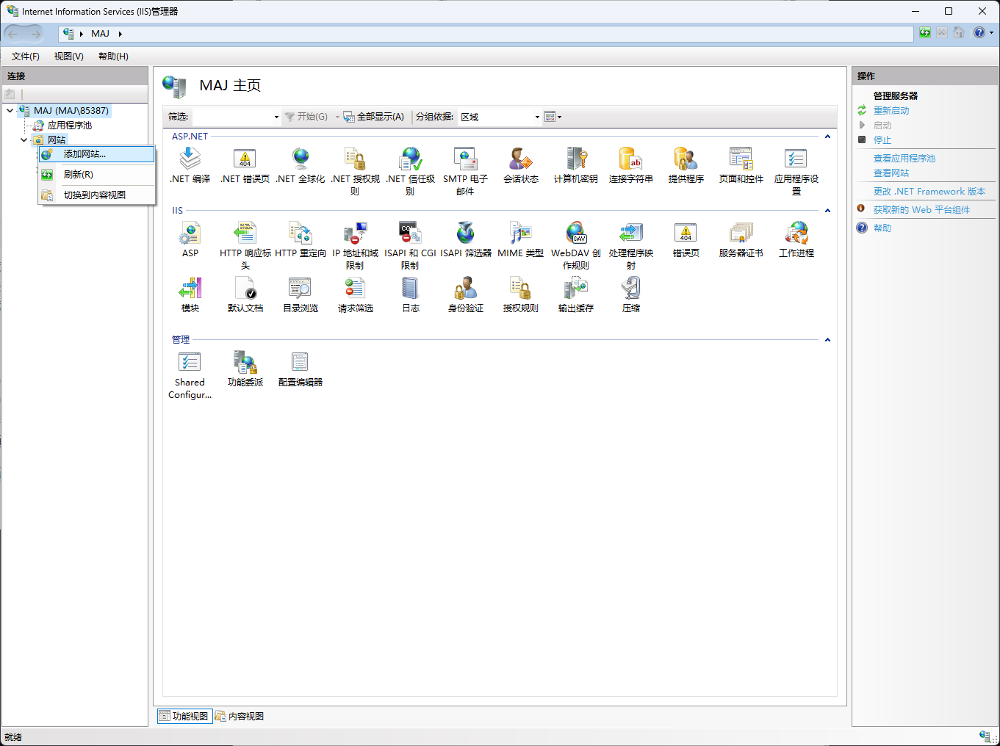
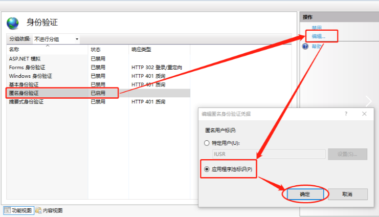
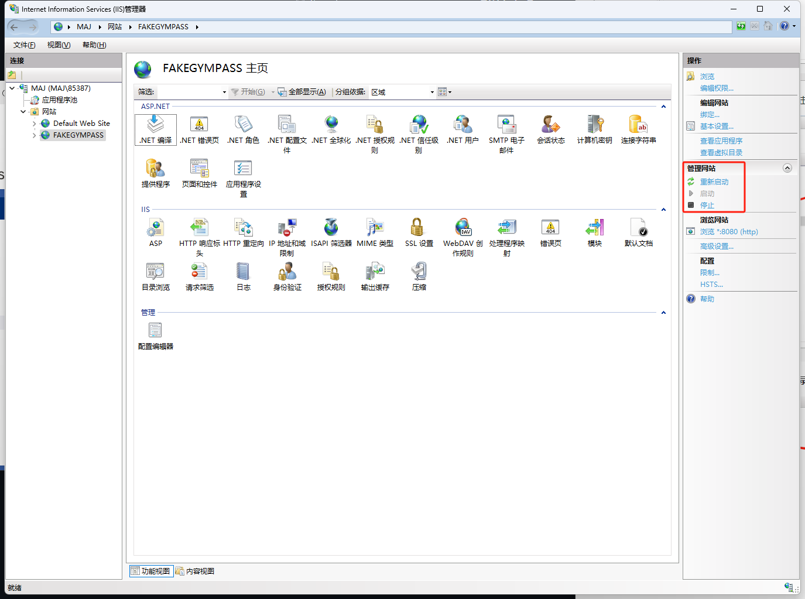
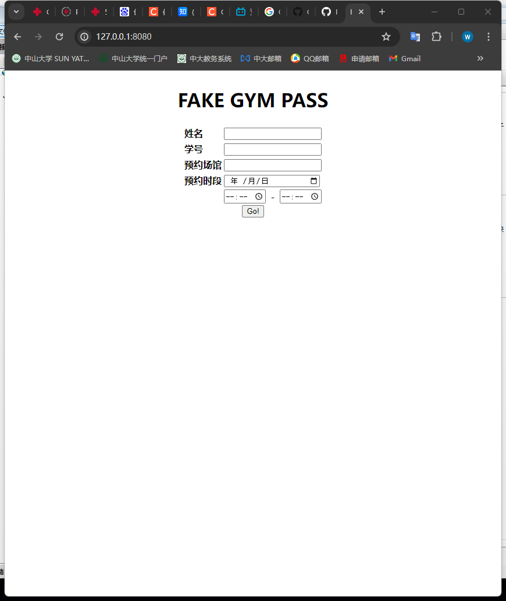
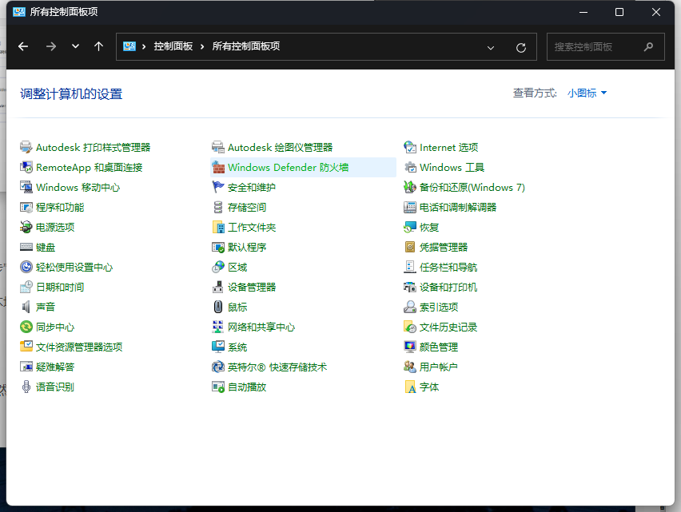
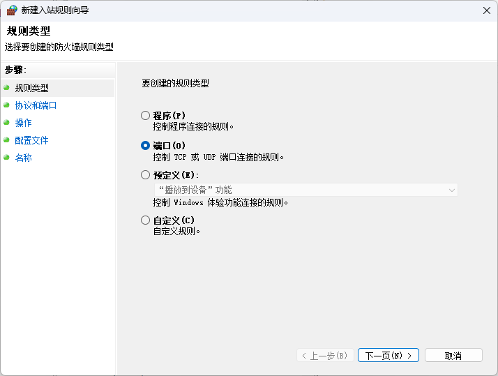
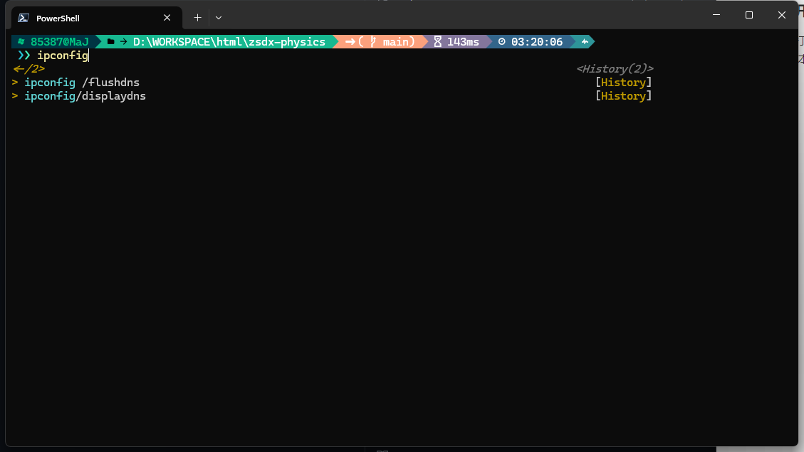

# 部署教程

**熟悉web服务器部署的同学可以跳过，项目是开箱即用的。**

本项目的部署方式有两种：

1. 部署在个人笔记本电脑上，项目的作用范围仅限于局域网内，门槛较低，在之后会介绍如何部署
2. 部署在服务器上，只要能够连接服务器的地方都可以使用，以校内的网络环境可以部署在学校实验室**连接有线网络**的服务器电脑上，这样只要连接到无线校园网的移动设备都可以访问。（如果是windows服务器的话，应该也适用1中的部署方法）

## 个人笔记本电脑部署

由于本人只有windows电脑，因此使用mac电脑的同学请自行搜索如何搭建web服务器的教程

个人笔记本电脑部署本项目后，只能在电脑与移动设备处于同一局域网内时才能正常使用（因为没有公网ip）。换句话说，只有当电脑和手机连接到同一WiFi下才能正常使用，无论是**电脑开热点连手机**或者**手机开热点连电脑**都可以，在家里**连接同一个WiFi**也可以

但是**中大校园网SYSU_SECURE由于网络设置的原因无法正常使用**。

个人笔记本电脑部署分为两步：

1. 使用Windows IIS搭建web服务
2. 关闭防火墙对端口的拦截

### 第一步：使用Windows IIS搭建web服务

首先需要打开 **启用或关闭Windows功能** 页面。Win11用户可以直接在开始菜单中搜索

其他windows版本的用户可以在控制面板中搜索到这一项

在打开的窗口中如图将**Internet Information Services**条目下这些项目勾选。注意下面的**Internet Information Services可承载的Web核心**不用勾选，点击确定。

等待系统安装完成后，进入控制面板，进入**管理工具**（在我电脑上叫**Windows工具**）

选择**Internet Information Services (ISS)管理器**

在左侧的**网站**，右键选择**添加网站**

在弹出的 *添加网站* 页面，可以进行设置。“网站名称”可以自己随意命名，“应用程序池”选择“DefaultAppPool”，“物理路径”选择存放该项目的文件夹，“端口”可以写自己电脑不用的端口，比如我写的是8080，然后点击确定即可。

接着回到管理器中，选择新建的网页，在右边找到**身份验证**选项，双击

在**身份验证**页面中，点击**匿名身份验证**，在右侧点击“编辑”，选择“应用程序池标识”，然后确定

再次点击左侧新建的网页回到管理器主页，选择**目录浏览**选项，双击，在目录浏览页面中选择启用。

最后确认在管理器中，新建的网站属于启动状态

然后打开电脑浏览器输入<http://127.0.0.1:8080>(这里的8080改成刚才在上面设置过的端口)，正常情况下就可以看到如图页面，项目打开成功。

### 第二步：关闭防火墙对端口的拦截

打开控制面板，选择**Windows Defender 防火墙**（Win11可以直接在开始菜单中搜索）

在左侧导航栏中选择“高级设置”，在弹出的窗口中点击“入站规则”，在右侧面板中点击“新建规则”

在弹出窗口中选择**端口**-->**下一页**-->**TCP**->**特定本地端口 8080(替换成刚才上面设置的端口)**-->**一直下一页到最后一步**

最后一页的名称可以自己随便写，点击“完成”即可。

完成这一步之后，与电脑连接到同一WIFI的移动设备应该就可以通过浏览器打开项目页面了。

### 附录：移动端打开项目页面

要在移动端打开项目页面，首先需要查询电脑的局域网IP是什么。**首先让电脑和手机处于同一局域网（开热点什么的都可以）**，然后win11用户可以右键开始图标，选择“终端”，其他版本用户可以自行搜索“如何打开cmd”。

在弹出的窗口中输入`ipconfig`，回车

查看其中**无线局域网适配器 WLAN**相关的信息（有的系统中这一项可能是英文的，可以直接找带“WLAN”的字眼）

可以看到对应的IPv4地址为192.168.3.13，那么此时可以打开手机，在浏览器输入<http://192.168.3.13:8080>（中间的数字改为IPv4对应的地址，8080改为上面设置的端口）进行访问，应该就可以打开项目页面了。为了逼真，可以在企业微信中找一个联系人发消息，消息内容就为这个网址。消息发送后这个网址可以点击进入。

部署完成。之后电脑关机重启或者是需要重新打开该项目**均无需重新部署**，电脑开机自动启动该网页的运行，只需要开机后电脑手机连接热点，手机即可直接访问网页。如遇打开失败，可能是电脑IP发生了变化，按照 **附录：移动端打开项目页面** 的教程重新查看一次电脑的IPv4地址即可。

这种部署方式的缺点在于需要保持手机与电脑之间的热点或者WIFI连接才能持续访问。在实际应用中可以在宿舍完成部署，用手机打开网页后填好信息，一路打开至订单详细页面，然后保持这个页面不要关掉或者防止被杀后台，即可让手机离开电脑。只要不发生页面跳转或者需要重新进入页面的情况，那网页是可以一直保留的。
